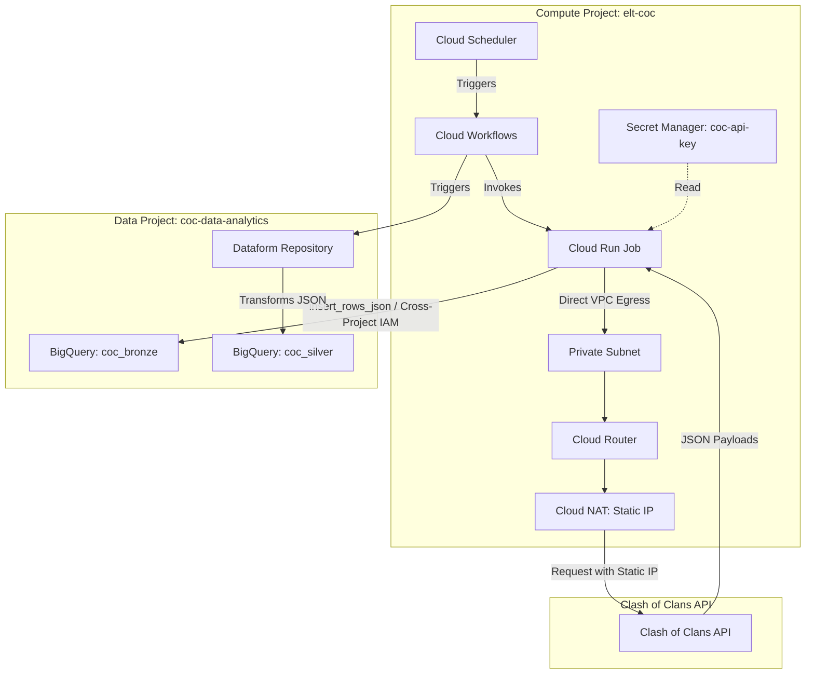

# Cross-Project ELT Pipeline Implementation Plan

This document outlines the detailed architecture and implementation plan for deploying a production-ready, cross-project ELT pipeline on Google Cloud Platform to fetch raw Clash of Clans API data, ingest it to BigQuery, and prepare it for Dataform transformation.

---

## 1. Requirements (WHAT is needed) - EARS Notation

- **R1 (VPC Egress)**: The system MUST route all Cloud Run Job egress traffic through a Cloud NAT static IP using Direct VPC Egress.
- **R2 (Authentication Security)**: The system MUST store the Clash of Clans API key in Secret Manager and access it at runtime using the dedicated Service Account.
- **R3 (Cross-Project IAM)**: The system MUST bind `roles/bigquery.dataEditor` at the dataset level and `roles/bigquery.jobUser` at the project level in the Data Project to the dedicated Service Account in the Compute Project.
- **R4 (Capital Raids Schedule)**: WHEN the current day of the week is Tuesday, Wednesday, or Thursday in UTC, the system MUST NOT fetch capital raids data.
- **R5 (Active War Filtering)**: WHEN the current war state is `notInWar`, the system MUST NOT write war data to BigQuery.
- **R6 (Timezone Standardization)**: The system MUST localize the `extracted_at` timestamp to UTC before writing to BigQuery.
- **R7 (Table Partitioning)**: The system MUST configure BigQuery Bronze tables to be partitioned by day using the `extracted_at` timestamp column.
- **R8 (Bronze Schema Structure)**: The system MUST use a two-column schema (`extracted_at` as TIMESTAMP, `payload` as JSON) for all BigQuery Bronze tables.
- **R9 (API Retry and Logging)**: IF the Clash of Clans API returns an HTTP error status (4xx or 5xx) THEN the system MUST log the error details and raise a runtime exception to fail the Cloud Run Job.
- **R10 (Clean Up)**: The system MUST delete all local files in `/tmp/etl_coc_data/raw/` after a job run completes.
- **R11 (Orchestration Pipeline)**: The system MUST run Cloud Scheduler to trigger a Cloud Workflow, which executes the Cloud Run Job first, and then triggers Dataform compilation and execution in the Data Project.

### Verifiable Tests:
- **T_R1**: Inspect execution routing logs or query the external NAT IP during a run to verify routing.
- **T_R2**: Execute a dummy run and check logs/secrets access configurations to confirm API tokens are retrieved from Secret Manager.
- **T_R3**: Attempt writing a test payload to BigQuery dataset from Compute project service account and verify permissions.
- **T_R4**: Unit test schedule check using mocked datetime values for weekends and weekdays.
- **T_R5**: Unit test parsing of `/currentwar` endpoint to verify that a payload of `notInWar` is not loaded.
- **T_R6**: Verify datetime object has timezone timezone-aware UTC component.
- **T_R7**: Inspect partitioned properties on tables in BigQuery schema.
- **T_R8**: Confirm table schema consists of `extracted_at` and `payload` ONLY.
- **T_R9**: Mock Clash of Clans HTTP 4xx/5xx responses and verify exception is thrown and logs are captured.
- **T_R10**: Execute pipeline and check that `/tmp/etl_coc_data/` directory is cleared.
- **T_R11**: Verify Scheduler executes Workflow, which runs the job and compilation task sequentially.

---

## 2. Technical Decisions (HOW it will be built)

### Architecture Diagram


### Infrastructure Layout (Terraform)
We will define a multi-project setup within the Terraform codebase. Providers will configure resource management in both `elt-coc` (Compute) and the external Data project.

- **`terraform/network.tf`**:
  - `google_compute_network.vpc`: Custom VPC `coc-elt-vpc`.
  - `google_compute_subnetwork.private_subnet`: Subnet `coc-elt-subnet-us-east1` with private Google access.
  - `google_compute_router.router`: Cloud Router mapping NAT.
  - `google_compute_router_nat.nat`: Configured with a static IP allocation (`google_compute_address.nat_ip`).
- **`terraform/security.tf`**:
  - `google_service_account.elt_runner`: Service Account for Cloud Run Job execution.
  - `google_secret_manager_secret.coc_api_key`: Stores API credentials.
  - `google_secret_manager_secret_iam_member.accessor`: Grants access of the secret to `elt_runner` (Resource level).
  - `google_project_iam_member.bq_job_user`: Grants `roles/bigquery.jobUser` on the Data Project to `elt_runner`.
  - `google_bigquery_dataset_iam_member.bq_data_editor`: Grants `roles/bigquery.dataEditor` on the target datasets in the Data Project (Dataset level).
  - `google_workflows_workflow_iam_member.workflows_invoker`: Grants `roles/workflows.invoker` strictly on the workflow.
  - `google_cloud_run_v2_job_iam_member.run_developer`: Grants `roles/run.developer` strictly on the Cloud Run job.
  - `google_service_account_iam_member.sa_user_self`: Grants `roles/iam.serviceAccountUser` strictly on itself.
  - `google_dataform_repository_iam_member.dataform_editor`: Grants `roles/dataform.editor` strictly on the `coc-elt` Dataform repository.
- **`terraform/bigquery.tf`**:
  - `google_bigquery_dataset.bronze`: Dataset `coc_bronze` located in `us-east1` in the Data Project.
  - `google_bigquery_table.tables`: Defines individual Bronze tables with daily partitioning configurations on `extracted_at`.
- **`terraform/compute.tf`**:
  - `google_cloud_run_v2_job.elt_job`: Configured with Direct VPC Egress pointing to the private subnet and VPC network, routing `ALL_TRAFFIC` to egress through the NAT Gateway.
  - `google_workflows_workflow.workflow`: Sequence definition of orchestrations.
  - `google_cloud_scheduler_job.scheduler`: Daily trigger configuration.

### Python Ingestion Strategy
We will implement raw data fetching using requests and upload to BigQuery using the standard Python Client Library with `insert_rows_json` for JSON ingestion.

- **`src/coc_elt/api_client.py`**:
  - Encapsulates requests. Handles URL encoding of `#` using `urllib.parse.quote`.
  - Schedules checking functions (`is_capital_raid_day()`, `is_war_active()`).
- **`src/coc_elt/bq_client.py`**:
  - Initializes `google.cloud.bigquery.Client`.
  - Encapsulates schema configurations and payload formatting.
  - Formats payloads as `{"extracted_at": datetime_utc.isoformat(), "payload": raw_json}`.
  - Calls `insert_rows_json(table_id, [row_dict])` using the fully qualified table name (`data-project.dataset.table`).

#### Selected Signatures:
```python
class CocApiClient:
    def __init__(self, api_key: str, clan_tag: str):
        self.api_key = api_key
        self.clan_tag = urllib.parse.quote(clan_tag)
        self.base_url = "https://api.clashofclans.com/v1/"

    def fetch_current_war(self) -> Optional[dict]:
        """Fetches active war. Returns None if state is 'notInWar'."""
        ...

class BigQueryIngester:
    def __init__(self, project_id: str, dataset_id: str):
        self.client = bigquery.Client()
        self.project_id = project_id
        self.dataset_id = dataset_id

    def ingest_record(self, table_name: str, payload: dict, extracted_at: datetime) -> None:
        """Writes localized payload and timestamp to Bronze table."""
        ...
```

### Discarded Alternatives
- **Serverless VPC Access Connector**: Discarded in favor of Direct VPC Egress. Direct VPC Egress is serverless, has zero scale-up delay, achieves higher throughput, and incurs no instance standby costs.
- **Strict schemas on Bronze ingest**: Discarded in favor of JSON payloads. Schema changes on Clash of Clans API would break ingestion jobs. Storing JSON objects defers transformations to Dataform where they are easily managed with SQL expressions (schema-on-read).
- **Storage Write API**: Discarded in favor of simple batch inserts (`insert_rows_json`). For a daily execution fetching small JSON data (<10MB), Storage Write API introduces complex grpc setup and overhead without performance benefits.

---

## 3. Dataform Configuration Placeholder Structure

We will deploy a Dataform placeholder structure within the repository directory `dataform/`.

- **`dataform/dataform.json`**:
```json
{
  "defaultProject": "coc-data-analytics-project",
  "defaultDataset": "coc_silver",
  "defaultLocation": "us-east1",
  "assertionDataset": "coc_assertions"
}
```

- **`dataform/package.json`**:
```json
{
  "name": "coc-elt-dataform",
  "dependencies": {
    "@dataform/core": "2.9.0"
  }
}
```

- **`dataform/definitions/sources.js`**:
```javascript
declare({
  database: "coc-data-analytics-project",
  schema: "coc_bronze",
  name: "clan_info"
});
declare({
  database: "coc-data-analytics-project",
  schema: "coc_bronze",
  name: "current_war"
});
declare({
  database: "coc-data-analytics-project",
  schema: "coc_bronze",
  name: "capital_raids"
});
```

---

## 4. Implementation Tasks (Concrete STEPS)

- [x] T1 — Create `dataform/dataform.json` and basic Dataform repository structure. Covers: R11.
- [x] T2 — Set up `terraform/backend.tf`, `variables.tf`, and `main.tf`. Covers: R1, R2, R3.
- [x] T3 — Write VPC, Subnet, Cloud Router, and NAT resources in `terraform/network.tf`. Covers: R1.
- [x] T4 — Write Secret Manager, Service Account, and IAM roles in `terraform/security.tf`. Covers: R2, R3.
- [x] T5 — Define BigQuery Datasets and partitioned Bronze Tables in `terraform/bigquery.tf`. Covers: R3, R7, R8.
- [x] T6 — Define Cloud Run Job (with Direct VPC Egress), Workflow, and Cloud Scheduler in `terraform/compute.tf`. Covers: R1, R11.
- [x] T7 — Add Python requirements in `pyproject.toml`. Covers: R6, R8, R9.
- [x] T8 — Create `src/coc_elt/config.py` for reading settings. Covers: R2.
- [x] T9 — Implement `src/coc_elt/api_client.py` for API data retrieval. Covers: R4, R5, R9.
- [x] T10 — Implement `src/coc_elt/bq_client.py` for BigQuery ingestion. Covers: R6, R8.
- [x] T11 — Implement `src/coc_elt/main.py` orchestrator and cleanup logic. Covers: R6, R8, R10.
- [x] T12 — Add unit tests in `tests/` for validation and schedules. Covers: R4, R5, R6, R9, R10.
