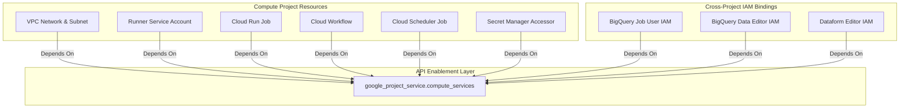

# Explicit Enablement of Google Cloud APIs in Terraform

This document defines the architectural decision and implementation plan for explicitly enabling required Google Cloud APIs within the Compute Project (`elt-coc`). Because we do not have permissions to manage APIs in the external Data Project, API enablement is restricted strictly to the Compute Project. Explicit dependency injection using Terraform's `depends_on` meta-argument is configured to ensure correct resource provisioning ordering within the Compute Project.

---

## 1. Requirements (WHAT is needed) - EARS Notation

- **R1 (Compute Project APIs)**: The system MUST enable the following APIs in the Compute Project (`var.compute_project_id`):
  - `iam.googleapis.com`
  - `cloudresourcemanager.googleapis.com`
  - `compute.googleapis.com`
  - `secretmanager.googleapis.com`
  - `run.googleapis.com`
  - `workflows.googleapis.com`
  - `cloudscheduler.googleapis.com`
- **R2 (No Data Project APIs)**: The system MUST NOT attempt to enable APIs in the external Data Project (`var.data_project_id`), as the deploying identity lacks administrative permissions in that project.
- **R3 (Compute Resources Dependency)**: The system MUST configure all resource definitions in the Compute Project to explicitly depend on `google_project_service.compute_services` to guarantee that the required APIs are fully operational before resource creation.
- **R4 (Cross-Project Resources Dependency)**: The system MUST configure all resources that cross project boundaries (such as cross-project IAM members) to depend on `google_project_service.compute_services` to ensure Compute services are active before provisioning.
- **R5 (API Destruction Prevention)**: IF any Terraform resource is destroyed, THEN the system MUST NOT disable the enabled APIs on the Compute Project.
- **R6 (Provisioning Failure)**: IF an API fails to enable due to insufficient permissions or invalid project IDs, THEN the system MUST halt Terraform application and report the enablement error immediately.

### Verifiable Tests:
- **T_R1**: Run `terraform plan` and verify that the `google_project_service.compute_services` resource contains exactly the 7 specified services.
- **T_R2**: Verify that no `google_project_service` resource is defined for `var.data_project_id` and that no BigQuery dataset or table resources contain `depends_on` links to a data project service resource.
- **T_R3**: Inspect `terraform/network.tf` and `terraform/compute.tf` to verify that all resources contain a `depends_on = [google_project_service.compute_services]` block.
- **T_R4**: Inspect `terraform/security.tf` to verify that all project-level and resource-level IAM bindings (including cross-project ones) contain `depends_on = [google_project_service.compute_services]` blocks.
- **T_R5**: Verify that `disable_on_destroy = false` is defined in the `google_project_service` resource block in `terraform/services.tf`.
- **T_R6**: Execute `terraform apply` with an invalid project ID and verify that the execution terminates early at the service enablement phase.

---

## 2. Technical Decisions (HOW it will be built)

### Architecture Schema & Dependency Chain


### Proposed File Modifications

#### 1. Create `terraform/services.tf`
This file will contain the loop definitions for API enablement:
```terraform
resource "google_project_service" "compute_services" {
  for_each           = toset([
    "iam.googleapis.com",
    "cloudresourcemanager.googleapis.com",
    "compute.googleapis.com",
    "secretmanager.googleapis.com",
    "run.googleapis.com",
    "workflows.googleapis.com",
    "cloudscheduler.googleapis.com"
  ])
  project            = var.compute_project_id
  service            = each.key
  disable_on_destroy = false
}
```

#### 2. Modify `terraform/network.tf`
Add `depends_on = [google_project_service.compute_services]` to:
- `google_compute_network.vpc`
- `google_compute_subnetwork.subnet`
- `google_compute_router.router`
- `google_compute_address.nat_ip`
- `google_compute_router_nat.nat`

#### 3. Modify `terraform/security.tf`
Add `depends_on = [google_project_service.compute_services]` to:
- `google_service_account.elt_runner`
- `google_secret_manager_secret_iam_member.accessor`
- `google_project_iam_member.workflows_invoker`
- `google_cloud_run_v2_job_iam_member.run_developer`
- `google_service_account_iam_member.sa_user_self`
- `google_project_iam_member.bq_job_user`
- `google_bigquery_dataset_iam_member.bq_data_editor`
- `google_project_iam_member.dataform_editor`

#### 4. Modify `terraform/compute.tf`
Add `depends_on = [google_project_service.compute_services]` to:
- `google_cloud_run_v2_job.elt_job`
- `google_workflows_workflow.workflow`
- `google_cloud_scheduler_job.scheduler`

#### 5. Modify `terraform/backend_bucket.tf`
Add `depends_on = [google_project_service.compute_services]` to:
- `google_storage_bucket.tf_state`

---

## 3. Discarded Alternatives
- **Enabling Data Project APIs via Terraform**: Discarded due to lack of administrative permissions in the Data Project.
- **Relying on implicit dependencies only**: Discarded because Terraform cannot deduce service activation order from implicit references, leading to transient creation errors.

---

## 4. Implementation Tasks

- [x] T1 — Create `terraform/services.tf` defining `google_project_service.compute_services` only. Covers: R1, R2, R5.
- [x] T2 — Modify `terraform/network.tf` to inject `depends_on = [google_project_service.compute_services]` into all network resources. Covers: R3.
- [x] T3 — Modify `terraform/security.tf` to inject `depends_on` constraints on compute project services. Covers: R3, R4.
- [x] T4 — Modify `terraform/compute.tf` to inject `depends_on = [google_project_service.compute_services]` for all compute resources. Covers: R3.
- [x] T5 — Modify `terraform/backend_bucket.tf` to inject `depends_on = [google_project_service.compute_services]` on the TF state bucket. Covers: R3.
- [x] T6 — Execute `terraform validate` to verify the configuration syntax. Covers: R6.
- [x] T7 — Execute `terraform plan` to verify the order of resource instantiation. Covers: R1, R2, R3, R4, R5, R6.
