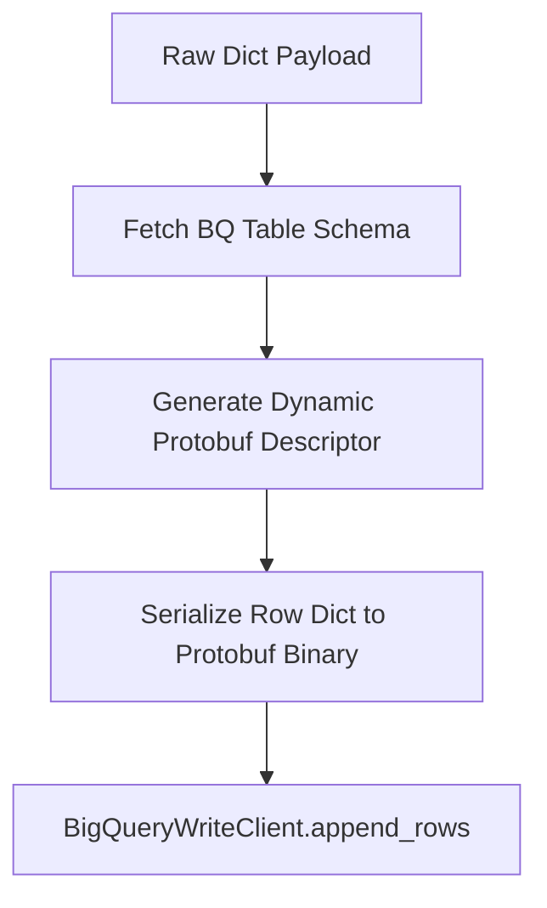

# Revised Implementation Plan: BigQuery Storage Write API Migration and Ingestion Fix

This document defines a two-phase implementation plan based on Spec-Driven Development principles to resolve the BigQuery legacy streaming ingestion error (`payload is not a record`) while maintaining strict code quality and preparing a migration to the BigQuery Storage Write API.

---

## Phase 1: The Hotfix (Code Quality Integrity)

This phase ensures the codebase is restored to its clean, native state, rejecting hacky string serialization in the pipeline logic and mandating that the native Python dictionary is passed directly to BigQuery.

### 1. Requirements (Phase 1)
*   **R1.1 (Native Dict Mandate):** The pipeline MUST pass the raw, un-serialized Python dictionary `Dict[str, Any]` representing the payload directly to the BigQuery client library.
*   **R1.2 (No Serialization Hack):** The system MUST NOT utilize `json.dumps()` or any other string serialization function to transform the `payload` field prior to calling `insert_rows_json`.
*   **R1.3 (Test Alignment):** The unit test suite in `tests/test_bq_client.py` MUST assert that a raw Python dictionary (not a serialized JSON string) is passed directly to the `insert_rows_json` mock.

### 2. Technical Steps (Phase 1)

1.  **Modify `src/coc_elt/bq_client.py`**:
    *   Verify that `json.dumps` is not imported or used.
    *   Ensure `BigQueryIngester.ingest_record` structures the row using the raw `payload` dict:
        ```python
        row = {
            "extracted_at": extracted_at.isoformat(),
            "payload": payload  # Passed directly as Dict[str, Any]
        }
        ```
    *   Execute `self.client.insert_rows_json(table_id, [row])`.

2.  **Modify `tests/test_bq_client.py`**:
    *   Ensure expected test assertions match the direct dictionary structure:
        ```python
        expected_row = {
            "extracted_at": "2026-07-11T12:00:00+00:00",
            "payload": payload  # Asserted as Dict[str, Any]
        }
        ```

3.  **Validation**:
    *   Run `uv run pytest` to guarantee all local tests pass and the pipeline integrity is preserved.

---

## Phase 2: Architectural Migration Plan (Storage Write API)

To resolve the backend API limitation of legacy streaming inserts (`tabledata.insertAll` / `insert_rows_json`) regarding native `JSON` columns, this phase details the technical design for migrating the ingestion client to the gRPC-based **BigQuery Storage Write API**.

### 1. Architectural & Technical Benefits
*   **Exactly-Once Semantics:** By utilizing dedicated write streams (Committed/Pending) and tracking stream offsets, the Storage Write API guarantees exactly-once writing across worker attempts, eliminating duplicate records due to retries.
*   **FinOps Cost Reduction:** BigQuery Storage Write API charges **50% less** per GB of streamed data compared to legacy streaming inserts. Additionally, the first **2 TiB per month** of data ingestion is completely free across the billing account.
*   **Native JSON Column Support:** Unlike the legacy API, the Storage Write API natively handles nested JSON column types by performing structured protobuf schema mapping, bypassing the legacy `is not a record` validation failures.

### 2. Package Dependency Requirements
The project must include the following package dependencies in `pyproject.toml` (and sync them via `uv`):
*   `google-cloud-bigquery-storage >= 2.14.0` (provides `BigQueryWriteClient` and associated gRPC writers)
*   `protobuf >= 4.21.0` (required for Protocol Buffer serialization)

### 3. Structural Approach (Managed JSON Stream Writer)
Since Python does not have a static `JsonStreamWriter` helper class (unlike the Java SDK), we will use a **dynamic protobuf schema serialization** pattern to avoid managing complex static `.proto` files in the source tree:



1.  **Dynamic Schema Generation:**
    *   Initialize the `BigQueryWriteClient`.
    *   Fetch the destination table schema programmatically using the BigQuery API.
    *   Generate a Protocol Buffer `DescriptorProto` dynamically based on the table's field types (TIMESTAMP, JSON, etc.) using `google.protobuf.descriptor_pb2`.
2.  **Message Serialization:**
    *   Construct a dynamic protobuf message class from the descriptor.
    *   Convert Python datetime objects to microseconds since epoch (int64) for the `extracted_at` TIMESTAMP field.
    *   Map the `payload` dictionary to the dynamically generated message structure.
3.  **Data Streaming:**
    *   Open a write stream using the client (typically the `_default` stream of the table for at-least-once ingestion, or a custom stream for exactly-once).
    *   Wrap the serialized rows in an `AppendRowsRequest` payload.
    *   Asynchronously send the request using gRPC streaming.

---

## 3. Implementation Tasks (Phase 1 tasks)

- [x] T1 — Ensure `src/coc_elt/bq_client.py` passes native `Dict[str, Any]` directly to `insert_rows_json` and contains no `json.dumps()`.
- [x] T2 — Ensure `tests/test_bq_client.py` asserts against the native dictionary.
- [x] T3 — Execute `uv run pytest` to verify the local unit tests.
